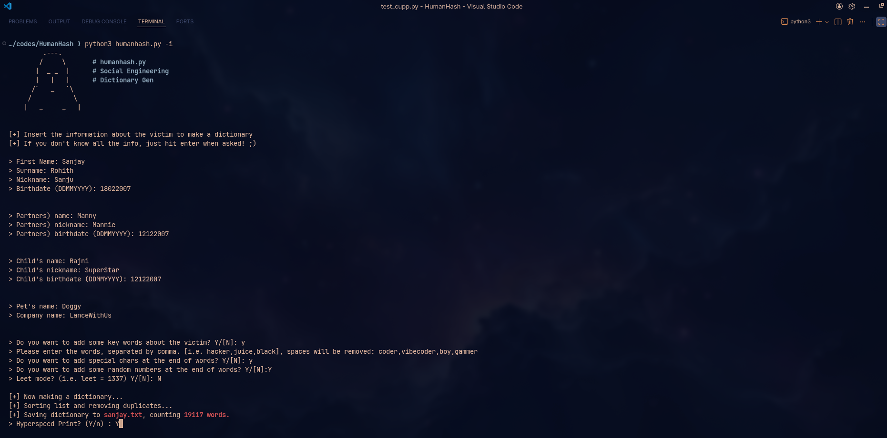

<p align="center">
  
</p>

<h1 align="center">🔐 HumanHash</h1>
<p align="center">
  <strong>Common User Passwords Profiler</strong>
</p>

<p align="center">
  
  
  
</p>

---

## 🎯 What is HumanHash?

HumanHash generates **personalized password wordlists** based on target information. People often create weak passwords using personal details like birthdays, pet names, or loved ones' names — HumanHash exploits this behavior for security testing.

> ⚠️ **For authorized security testing and educational purposes only.**

---

## ⚡ Quick Start

```bash
# Clone the repository
git clone <your-repo-url>
cd humanhash

# Run HumanHash
python3 humanhash.py -h
```

---

## 🛠️ Usage

```
python3 humanhash.py [OPTIONS]
```

| Option | Description |
|:------:|-------------|
| `-i` | 🎤 **Interactive mode** — Answer questions to generate a custom wordlist |
| `-w` | 📝 **Improve wordlist** — Enhance an existing dictionary file |
| `-l` | 📥 **Download wordlists** — Fetch large wordlists from repository |
| `-a` | 🗄️ **Alecto DB** — Parse default credentials from Alecto database |
| `-v` | ℹ️ **Version** — Display program version |
| `-h` | ❓ **Help** — Show help menu |

---

## 🎮 Interactive Mode

The most powerful feature — generates passwords based on target profile:

```bash
python3 humanhash.py -i
```

You'll be prompted for:
- 👤 Name, surname, nickname
- 🎂 Birthdate
- 💑 Partner's information
- 👶 Children's information
- 🐕 Pet names
- 🏢 Company name
- 🔑 Custom keywords

---

## ⚙️ Configuration

Customize behavior via `humanhash.cfg`:

- **Leet mode substitutions** (a→4, e→3, etc.)
- **Special characters** to append
- **Year ranges** for combinations
- **Password length** filters

---

## 📁 Project Structure

```
humanhash/
├── humanhash.py          # Main script
├── humanhash.cfg         # Configuration file
├── test_humanhash.py     # Unit tests
└── screenshots/     # Demo assets
```

---

<p align="center">
  Made with ☕ for the security community
</p>


    

